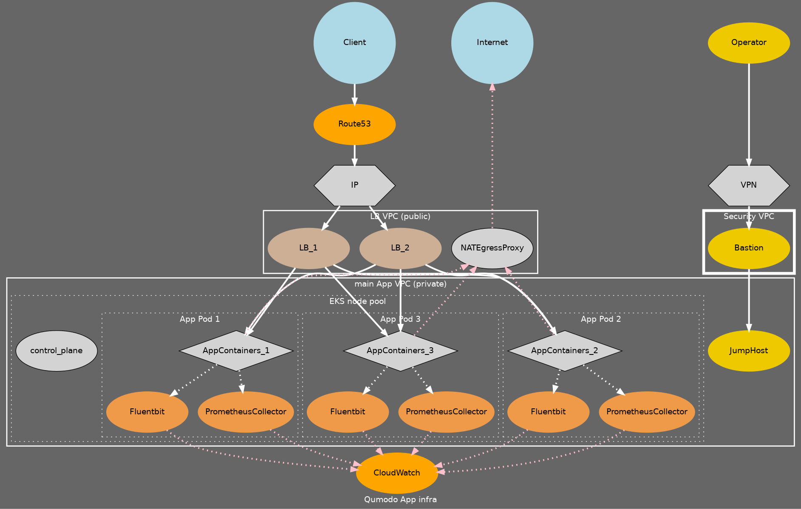

# DevOps example EKS simple application

# 1. Deployment

For infrastructure setup of compute instances, network, IAM and security I would use Terraform.

* VPCs, Internet Gateways, NAT Gateways, Route tables, subnets, DHCP
  [VPC module](https://registry.terraform.io/modules/terraform-aws-modules/vpc/aws/latest)
* Network access controls, inter-vpc traffic security, ingress/egress traffic security
  [Security Groups module](https://registry.terraform.io/modules/terraform-aws-modules/security-group/aws/latest)
* VPN access
  [VPN module](https://registry.terraform.io/providers/hashicorp/aws/latest/docs/resources/vpn_connection)
* Kubernetes cluster management
  [EKS module](https://registry.terraform.io/modules/terraform-aws-modules/eks/aws/latest)
* IAM for EKS and other policy management
  [IAM module](https://registry.terraform.io/modules/terraform-aws-modules/iam/aws/latest/submodules/iam-policy)
* Jump hosts, Bastion hosts
  [EC2 instance module](https://registry.terraform.io/providers/hashicorp/aws/latest/docs/resources/instance)
* Load Balancers and health checks for backend groups
  [ELB](https://registry.terraform.io/providers/hashicorp/aws/latest/docs/resources/lb)
* Log and metric aggregation and visualisation
  [Cloudwatch](https://registry.terraform.io/modules/terraform-aws-modules/cloudwatch/aws/latest)

## Architecture

See the graphviz dot code for generating svg or other formats of image or see the diagram below.

## VPCs

The below description is for a single region within AWS. For redundancy and performance multiple copies of this
infrastructure will be built in different regions across the United States. Geographically aware DNS will report a
service endpoint to the user depending on their location to ensure they are talking to the closest AWS region data
centre.

### Security VPC

Provides access to redundant bastion hosts via SSH over a VPN. The VPN gateway being an AWS managed client VPN. The
bastions are managed EC2 instances with a redundancy in each availability zone for the region.

### LB VPC (public)

This houses the main ingress network transport from the Internet to AWS ELB load balancers. These present over a series
of public elastic IPs and manage backend connections to inginx proxies (k8s) to the App containers. There would be
configured health checks in the LBs.

It also houses an AWS managed NAT egress gateway per availability zone. There is redundancy built into the gateway with
compartmentalisation between availability zones in AWS. This is the main egress gateway for instances in the region.

### Main App VPC (private)

The main App VPC is home to a operator access jump host that an operator would use to get from the security network to
the main app network. This is the only way to get into the network via SSH.

It also houses a AWS EKS / Kubernetes cluster with a dynamically scalable node instance pool.
There is a pod for each availability zone, with affinity to nodes in the node pool which reside in different
availability zones. These automatically scale number of container instances based on health-checks monitored by
Kubernetes as configured in the deployment. Each pod also contains a FluentBit log collector and a Prometheus metrics
collector. All logs and metrics from the App containers in the pod are sent to the collectors, and the collectors
forward this traffic to the AWS CloudWatch service.

# 3. Monitoring

I initially thought about having a VPC containing monitoring infra with a combination of Elasticsearch Logstash Kibana,
Grafana/Graphite endpoints for receiving data from the collectors. I would like to investigate how AWS CloudWatch could
be used instead.

# 4. Security

## Network security

Security group limits would ensure that the exact minimum of traffic required for the functionality of the
service. Traffic between subnets would similarly be limited to only what is required. Routes for traffic also only contains
what is required.

There is no egress access to the Internet from the App VPC except via return response to the client via the load
balancer. There is no egress to the internet from DB hosts.  Traffic over the proxy and internet gateway is
monitored and logged.

## Host security

EC2 instances would have a strict set of lockdown restrictions to make them compliant with a number of standards (such
as those provided by NIST). This would involve an assessment of the packages installed, services running, users and
groups configured, permissions, firewall configuration, enablement of SELinux and application sandboxing techniques.
Host Intrusion Detection, file integrity monitoring and virus scanning would be performed multiple times a day and would
report back to a centralised log capture system. Logs would be sent off the host (via fluentd) and stored for analysis
for nefarious activity.

The host operating system AMI (compute image) would regularly be updated (once a month) and packages monitored for
integrity and security vulnerabilities. Any critical vulnerabilities updated within an agreed timeframe depending on the
sensitivity and type of data transferred through or held on the hosts.

## Application security

Code will be scanned in code repositories using static code analysis tools for known insecure coding styles. 3rd party
software dependencies would be checked and monitored for security vulnerabilities. I would work with developers to
ensure that secure coding standards adhered to and develop a risk matrix for security vectors observable across the
service. Appropriate mitigations of identified vectors would be worked on through collaboration between developers and
SRE/devops.

All golang applications would be run in containers configured with read-only root file systems and non-privileged users.
All logs and metrics collection will be sent off the host and not stored with the container. It appears that the
application is stateless otherwise.

All traffic between the App hosts will be over SSL. Managed Public Key Infrastructure allowing
for certificate chain validation and client authentication from the container. All secrets would be stored in a Vault
secret store. Any access to cloud level resources could be assessed to see if they can be authenticated via instance or
service principals rather than passwords, tokens or keys (OCI-ism).

# 5. Maintenance

All infrastructure, host configuration and application setup will be expressed as code using a combination of
Terraform (or Cloudformation?), Chef cookbooks and Helm Charts. Therefore, it should be feasible to completely rebuild
the entire service with minimal time and human input. Configuration and functional code will be kept separately so that
it is possible to replicate the service into different environments. It would be possible to create development and
staging instances as well as easily create one off instances as part of integration testing. Frameworks such as Inspec
and Serverspec could be used to validate that the infrastructure is functional. CI/CD tooling such as Gitlab or Jenkins
would be used to build these instances automatically when code commits occur. Testing passes could be used to trigger
canary style deployments into staged environments (e.g., dev -> test -> prod). In a "canary" deployment, simulated
behaviour of a customer client would replicate traffic over the service and raise alarms to on-call personnel when
unexpected failures occur. They would verify that testing pipelines were operating correctly and produce code test cases
for the future to detect faults that weren't previously monitored.

As mentioned before, regular AMI machine image and docker image updates (where relevant) would be performed and injected
into build processes to uptake the current releases of OS packaging. These images would be performed using pipelines
configured in CI/CD. EC2 Image builder service would be used for AMIs.

Deployments would be triggered via the control plane hosts in each VPC to the ECS clusters. It might be worth
investigating different models of configuration management for hosts that require it versus the build-in node management
tools for AWS services and Kubernetes.
